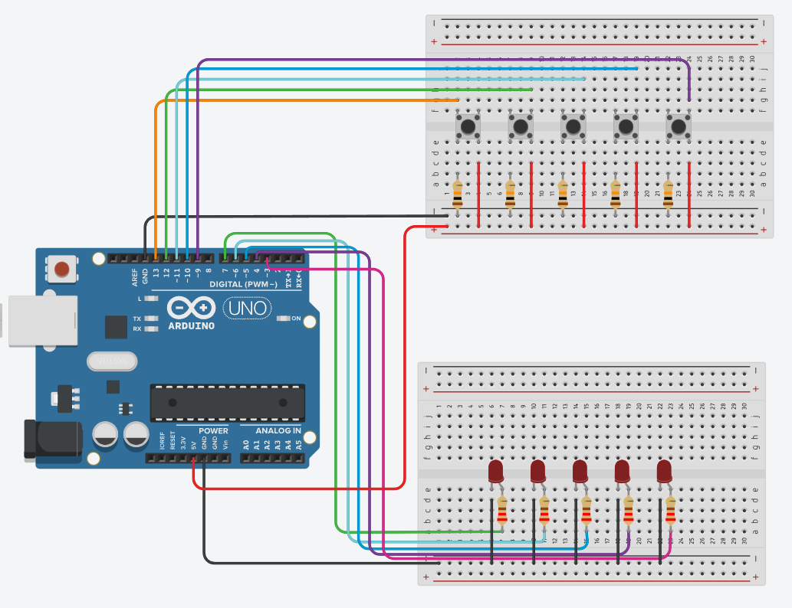
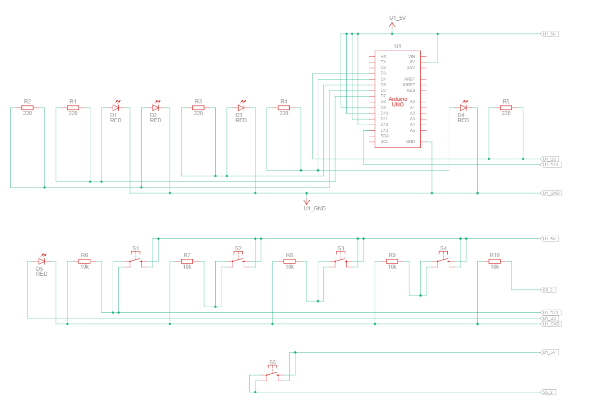

# Arduino – 4 Buttons Controlling 4 LEDs

This project presents a simple circuit built with an **Arduino Uno**, where each of the four buttons controls one LED. Pressing a button turns on the corresponding LED.

## Components Used

- Arduino Uno
- 4 × momentary push button
- 4 × LED (any color)
- 4 × 10kΩ resistors (pull-down for buttons)
- 4 × 220Ω–330Ω resistors (for LEDs)
- Breadboard
- Jumper wires

## ⚙️ How It Works

Each button is connected to a separate digital pin on the Arduino and works with a 10kΩ resistor as a **pull-down**, to prevent random high state readings. When a button is pressed, the assigned LED lights up.

The 10kΩ resistors are connected between GND and each button's input pin.

## Circuit Photos

### Breadboard Overview
<!-- Insert a top-down photo of the entire setup -->

### Close-up of Buttons and Resistors
<!-- Insert a close-up photo of button wiring and resistors -->

